Battle Farm
=================

## Table of Contents

<!-- TOC -->
* [Trivia](#trivia)
* [Game Entities](#game-entities)
  * [Player Possession](#player-possession)
    * [Coins](#coins)
    * [Hand](#hand)
    * [Fertilizers](#fertilizers)
    * [Garden Beds](#garden-beds)
  * [Game Area](#game-area)
    * [Deck](#deck)
    * [Market](#market)
    * [Dices](#dices)
* [Game Preparation](#game-preparation)
* [Turn Sequence](#turn-sequence)
  * [Buying Seeds](#buying-seeds)
  * [Trade](#trade)
  * [Playing Cards](#playing-cards)
  * [Using Fertilizers](#using-fertilizers)
  * [Win Limit](#win-limit)
* [Cards](#cards)
  * [Rarity](#rarity)
  * [Card Value](#card-value)
  * [Crops](#crops)
  * [Crop Cards](#crop-cards)
  * [Action Cards](#action-cards)
* [Classes](#classes)
<!-- TOC -->

## Trivia

`Battle Farm` is a turn based card game for 2-6 Players. Every Player has a number of garden beds which they can improve and plant different crops to. If a crop yield harvest, a Player gains coins. When the game ends, the Player with the highest amount of coins wins. The `battle` part of it comes from different actions that, that Players can invoke upon each other with limited Cards to gain advantage.

## Game Entities

### Player Possession

#### Coins

Coins are symbolic tokens that represent the Game score of a Player and can be expended to acquire [Cards](#cards). Harvesting [Crops](#crops) yields Coins, as well as do some other game actions, including [Trade](#trade). Collecting Coins is essential to win the Game, as regardless of how it ends the winner is the Player with the biggest bank. The amount of Coins every Player has is visible to other players, as well as the [Win Limit](#win-limit).

#### Hand
Player can have any number of [Cards](#cards) in their hand, starting with 3 or more at the beginning of the Game. Players' Hands are not visible to other Players but their respective owners, but the total number of [Cards](#cards) every Player has - is.

#### Fertilizers
Fertilizers are special expendable tokens that are used by Players to play [Action Cards](#action-cards) or to make [Crops](#crops) ripe faster, up to being instantaneously harvested. All players know how many Fertilizers each of them have at every moment. The only source of Fertilizers during the Game are [Cards](#cards). 

#### Garden Beds
or just **Beds** are spots are where [Crops](#crops) are grown. They are positioned in front of each Player and are visible to all participants of the Game. They come in different types that provide additional properties to grown [Crops](#crops). Different Player [Classes](#classes) start with different sets of [Beds](#garden-beds), and they can be changed, acquired or destroyed during the Game with special [Cards](#cards).

| Garden Bed     | Special Bonus                                                        |
|----------------|----------------------------------------------------------------------|
| Common Bed     | No bonuses                                                           |
| Raised Bed     | +2&nbsp;`Crop Value` for `Rare`, `Epic` and `Mythic` [Crops](#crops) |
| Greenhouse     | The [Crop](#crops) can't be targeted by negative Abilities           |
| Hydroponic     | -1&nbsp;`Reap Timer` for `Rare`, `Epic` and `Mythic` [Crops](#crops) |
| Trellis        | +1&nbsp;`Crop Value` for `Yellow` [Crops](#crops)                    |
| Rotational Bed | +1&nbsp;`Crop Value` for `Red` [Crops](#crops)                       |
| Vertical Bed   | +1&nbsp;`Crop Value` for `Green` [Crops](#crops)                     |

### Game Area

#### Deck
There is a total of **204** [Cards](#cards) in a Deck, having 5 different [rarities](#rarity), that define their quantity, and divided into two types: [Crop Cards](#crop-cards) and [Action Cards](#action-cards). A set amount of [Cards](#cards) is distributed between Players at the beginning of the Game, and the rest are hidden from Players, only acquired by drawing. When the Deck is finished, the Game is over too.

#### Market
Card Market is a special area, where [Cards](#cards) are stored with their face up, visible to Players. Players can acquire those [Cards](#cards) by exchanging them for a constant amount of [Coins](#coins), depending on their [Rarity](#rarity). Market has **6** card slots which are refilled from the [Deck](#deck) immediately as the [Cards](#cards) are taken from them.

#### Dices

Certain Game actions require Players to challenge their luck by rolling a random number in a given interval. Those attempts might be performed with common DnD dices, and hereby are named accordingly:
* `d4` - a random number between 1 and 4
* `d6` - a random number between 1 and 6
* `d20` - a random number between 1 and 20
* `{N}d{R}` - N random numbers between 1 and R, usually used as a sum of values, unless the action specifies otherwise.

## Game Preparation

1. Every Player is randomly assigned 1 of 6 [Classes](#classes)
2. Every Player gains 1 common [Bed](#garden-beds), 3 random [Cards](#cards), 3 [Fertilizers](#fertilizers) and 3 [Coins](#coins)
3. Based on assigned [Class](#classes), the Player gains bonus [Cards](#cards), [Beds](#garden-beds), [Fertilizers](#fertilizers) and/or [Coins](#coins).
4. Every Player rolls 1d20 to determine the sequence of turns. If two or more Players roll the same value, the order between them is chosen randomly
5. Every Player gains 1 to 6 extra [Fertilizers](#fertilizers), in order determined at step 4. That means, the first Player to make a Turn gains 1 extra [Fertilizer](#fertilizers), the second one - 2, and so on.
6. 6 random [Cards](#cards) are placed on the field at the [Market](#market) area with their face up
7. Other [Cards](#cards) are put in a deck and placed on the field at the [Deck](#deck) area with their face down
8. The game starts with every Player making their turns in the order, determined at step 4.

## Turn Sequence

Every Player performs their turn in a certain sequence:

1. The Player reduces `Reap Timer` on each of [Crops](#crops) in their [Beds](#garden-beds). [Crops](#crops), having their `Reap Timer` equal to 0, are Harvested, being removed from its [Bed](#garden-beds) and yielding [Coins](#coins) to the Player, equal to its `Crop Value`

2. The Player has on option to acquire up to 1d4 [Cards](#cards) from the [Market](#market), if they have enough [Coins](#coins). The [Coins](#coins) are then discarded.

3. The Player has an option to propose a trade, offering other Players to buy any subset of his [Cards](#cards). Other Players then suggest the amount of [Coins](#coins) they wish to offer, and the current **Player** can accept one of the offers, if any, sealing the deal.

4. The Player can play any number of [Cards](#cards) one by one. 
5. The Player can use up to 1d4 [Fertilizers](#fertilizers) on any [Crops](#crops) they have to make them yield faster.
6. If by the end of their turn the Player has reached the [Win Limit](#win-limit) of [Coins](#coins), the current turn becomes the last one for all the following Players, and the Game ends afterwards 

### Buying Seeds

The current Player must roll a 1d4 and then pick at most that many [Cards](#cards) from the Market they wish to acquire in under 15 seconds. If they have enough [Coins](#coins), they discard them and take those [Cards](#cards) to their [Hand](#hand). 
After taking the [Card](#cards) from the [Market](#market), a new one is drawn from the [Deck](#deck) and placed to the same spot. If there are no more [Cards](#cards) left in the [Deck](#deck), the current turn becomes the last one for all the following Players, and the Game ends afterwards

### Trade

After a current Player has completed all the [Cards](#cards) acquisitions, they have 15 seconds to pick any number of [Cards](#cards) from their [Hand](#hand) and choose to `Trade` them, with an option to skip. All other Players receive a proposal and have 15 seconds up any number of [Coins](#coins) as their offer for those [Cards](#cards). Only the whole set of [Cards](#cards) chosen by the selling Player can be acquired, no partial deals are allowed. 

The selling Player receives all the suggested offers, if any, and has 10 seconds to chose whether they would accept one of them. If done so, the negotiation succeeds and the Players exchange [Coins](#coins) for [Cards](#cards). If they reject or doesn't make a choice before the timer expires, all Players keep their belongings to themselves.

### Playing Cards

The Player has 30 seconds to play any [Cards](#cards) in a sequence. When a Player plays a [Crop Card](#crop-cards), he plants that [Crop](#crops) in any free **Garden Bed**, setting its `Reap Timer` as defined by the [Card Rarity](#rarity). If there are no empty [beds](#garden-beds), the Player can only play [Action Cards](#action-cards). 

All the effects of the [Card](#cards) must be applied before the next [Card](#cards) is played
- To play a [Crop Card](#crop-cards), the Player should Plant it into an empty [Bed](#garden-beds), setting a `Reap Timer` on it, depending on the [Card](#cards) Rarity.
- To play an [Action Card](#action-cards), the Player should discard a number of [Fertilizers](#fertilizers), equal to [Card](#cards) `Value`. The [Card](#cards) is then discarded.

### Using Fertilizers

The current Player must roll 1d4. Then they have 15 seconds to use up to that number of  [Fertilizers](#fertilizers) to reduce the `Reap Timer` on any [Crop](#crops) in their [Beds](#garden-beds) by 1 turn per [Crop](#crops) per [Fertilizer](#fertilizers).

If the `Reap Timer` is reduced to zero on any given [Crop](#crops), it is immediately harvested, yielding [Coins](#coins), but the emptied [Bed](#garden-beds) can't be planted the same turn.

### Win Limit 
The `Win Limit` of [Coins](#coins) is set at the beginning of the Game depending on number of Players, and is calculated as
> 44 + 6 * `Total number of Players` + `Total sum of Crop Card values in Deck` / (1 + `Total number of Players`) rounded up

For instance, if a 1v1 Game is started with standard Deck, the `Win Limit` would be `44 + 12 + 582 / 3` = **250 Coins**

| Number of Players | Win Limit |
|-------------------|-----------|
| 2                 | 250       |
| 3                 | 208       |
| 4                 | 185       |
| 5                 | 171       | 
| 6                 | 164       |

## Cards

[Cards](#cards) are the main expendable source of the Game. There is a set quantity of each [Card](#cards) in the [Deck](#deck), and, once
the [Deck](#deck) is over, the Game is over too, if it was not finished earlier. Cards come in two flavours: [Crop Cards](#crop-cards)
and [Action Cards](#action-cards). [Crop Cards](#crop-cards) are the main source of Players income, with their value converted to [Coins](#coins) if a
Player manages to plant and then harvest it. [Action Cards](#action-cards) require [Fertilizers](#fertilizers) as expendables to be played and
offer unique options to manipulate the game field, bringing the owner closer to victory.

Every Player gets a given number of [Cards](#cards) in the beginning of the Game, depending on their [Class](#classes), and 6 more are
placed at [Market](#market) their face up. All the rest reside in [Deck](#deck) until required by certain actions. So at every moment of
the Game every Player sees only their [Hand](#hand) and the [Market](#market), as well as planted [Crops](#crops), which were previously **Crop
Cards**.

### Rarity

[Cards](#cards) come in 5 different Rarity grades, which define their `Market Price`, which is the amount of [Coins](#coins) a
Player must discard to obtain a [Card](#cards) of a given rarity from the  [Market](#market):

- `Common` [Cards](#cards) - 1 **Coin**
- `Uncommon` [Cards](#cards) - 2 [Coins](#coins)
- `Rare` [Cards](#cards) - 3 [Coins](#coins)
- `Epic` [Cards](#cards) - 5 [Coins](#coins)
- `Mythic` [Cards](#cards) - 8 [Coins](#coins)

### Card Value

Each [Card](#cards) has a single number associated with it, called `Card Value`. For `Crop Cards` that is a base for the
future `Crop Value`, which is then affected by various effects from **Garden Beds** and other [Cards](#cards).
For `Action Cards`, that is the number of [Fertilizers](#fertilizers) a Player should expend to play the [Card](#cards). Both values alike
can be modified with effects of other [Cards](#cards), which state explicitly they affect `Card Value`.

### Crops

[Crop Cards](#crop-cards) become [Crops](#crops) when played, and eventually yield [Coins](#coins), which are required to buy new [Cards](#cards) and
to win the game.

When played, a [Crop Card](#crop-cards) must be planted (placed) in an empty **Garden Bed**, becoming the same [Crop](#crops), where it
starts the countdown to Harvest, called
`Reap Timer`:

- `Common` [Crops](#crops) - 1 Turn
- `Uncommon` [Crops](#crops) - 2 Turns
- `Rare` [Crops](#crops) - 3 Turns
- `Epic` [Crops](#crops) - 4 Turns
- `Mythic` [Crops](#crops) - 5 Turns

After the given number of turns, the [Crop](#crops) is discarded from the [Bed](#garden-beds), granting [Coins](#coins) to the owning Player,
equal to its `Crop Value`. The `Value` of the [Crop](#crops) and its `Reap Timer` can be modified during growth with other [Cards](#cards). Combination of this params and acquisition cost is calculated as Gold Per Turn (`GPT`):
> `Gold Per Turn` = ( `Crop Value` - `Market Price` ) / `Reap Timer`

That means if a Player got a [Crop Card](#crop-cards) from effects of other [Cards](#cards), that number is mostly irrelevant, and the relative `Value` of the [Crops](#crops) is slightly altered. Notably, `Common` [Crop Cards](#crop-cards) gain +50-100% pure `Crop Value` if obtained without payment, while free `Uncommon` [Cards](#cards) become more profitable than even `Mythical` ones, if those were acquired from the [Market](#market).

If the [Crop](#crops) has a special effect on Harvest, it is immediately triggered for the current Player. If a Player manages to Harvest an Opponent's Plant with an [Action Card](#action-card), they are to apply its Effect as the Crop was theirs.

All [Crops](#crops) are divided into 3 groups: `Red`, `Green` and `Yellow`. Those groups don't have any properties themselves,
but affect how particular [Crops](#crops) interact with [Beds](#garden-beds), [Action Cards](#action-cards) and each other.

### Crop Cards

Number of [Crop Cards](#crop-cards) of each [Rarity](#rarity) decreases with its grade, and there is a known limit on every [Crop](#crops) type,
however certain [Action Cards](#action-cards) and [Class](#classes) bonuses can add more cards of certain type to the game above that limit.

That makes up for a total of **105 Crop Cards** with a total `Crop Value` of **582 Coins**

|                           Name                            | Group    |           Quantity | Effect                                                                                                                                                                                                                                  | Market Price | Card Value | Ripe Timer | GPT |
|:---------------------------------------------------------:|----------|-------------------:|-----------------------------------------------------------------------------------------------------------------------------------------------------------------------------------------------------------------------------------------|--------------|------------|------------|-----|
|        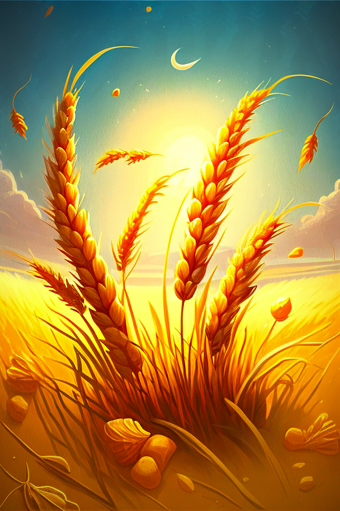 **Wheat**         | `Yellow` |   `Common`:&nbsp;8 | `Bake it Up`: when Fertilized, increases its Crop Value by 2                                                                                                                                                                            | 1            | 2          | 1          | 1   |
|        **Cherry**       | `Red`    |   `Common`:&nbsp;8 | `Cherry Picking`: when Harvested, all other `Common` [Cards](#cards) in your [Hand](#hand) gain 1 extra `Card Value`                                                                                                                    | 1            | 2          | 1          | 1   |
|     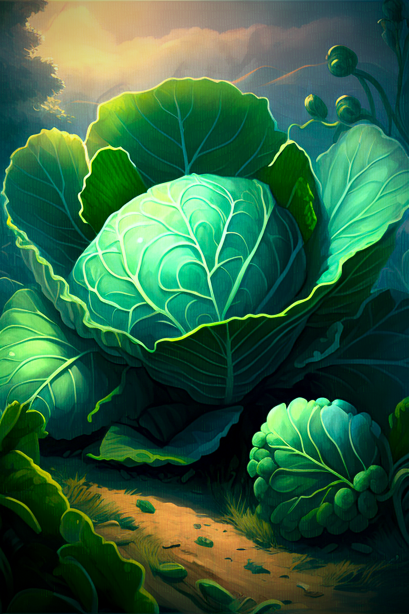 **Cabbage**      | `Green`  |        `Common`: 8 | `Head of Green`: when Harvested, gain 1 **Coin** for every other growing `Green` [Crop](#crops) in the game                                                                                                                             | 1            | 2          | 1          | 1   |
|          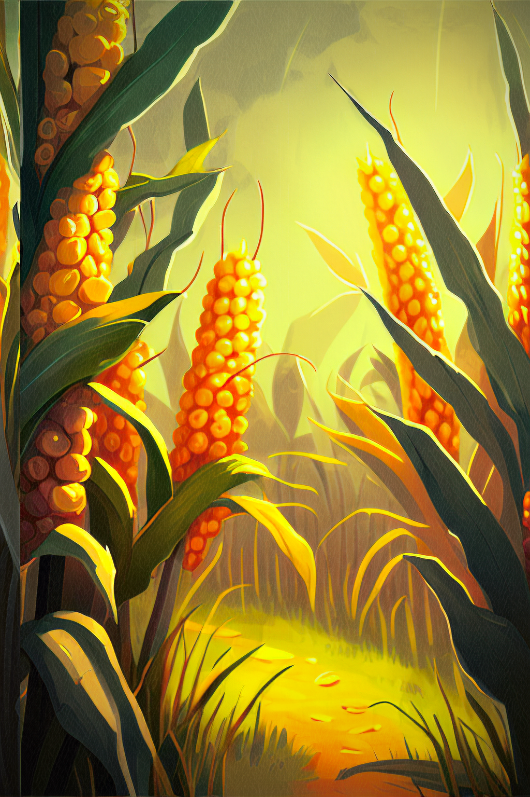 **Corn**          | `Yellow` |   `Common`:&nbsp;8 | `Yellow Patch`: when Harvested, gain 1 **Coin** for every other growing `Yellow` [Crop](#crops) in the game                                                                                                                             | 1            | 3          | 1          | 2   |
|       **Carrots**      | `Red`    |   `Common`:&nbsp;8 | `Red Alert`: when Harvested, gain 1 **Coin** for every other growing `Red` [Crop](#crops) in the game                                                                                                                                   | 1            | 3          | 1          | 2   |
|       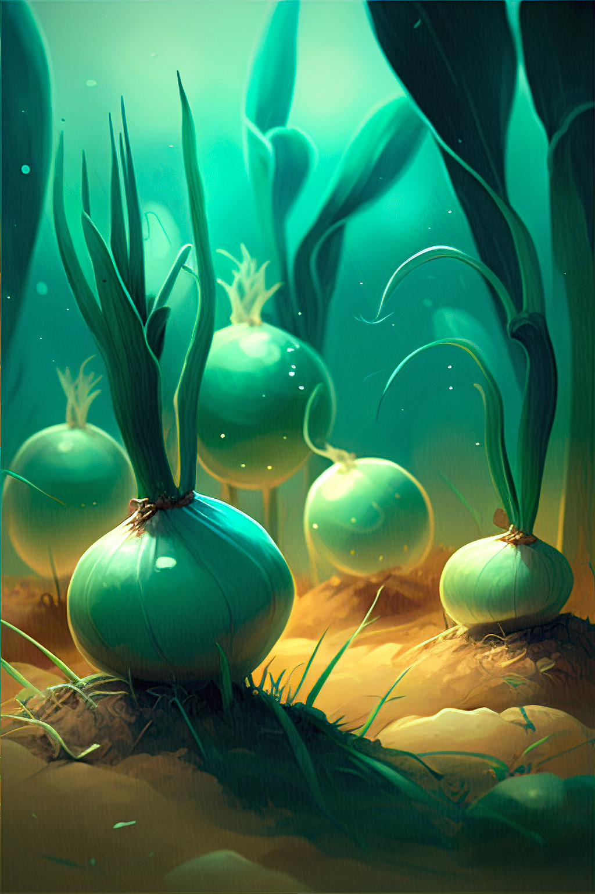 **Onions**        | `Green`  |   `Common`:&nbsp;8 | `Onion Ring`: when Planted, gain 1 [Fertilizer](#fertilizers) for every other `Onion` in your [Hand](#hand) and 1 **Coin** for every `Onion` [Crop](#crops) you have growing                                                            | 1            | 3          | 1          | 2   |
|        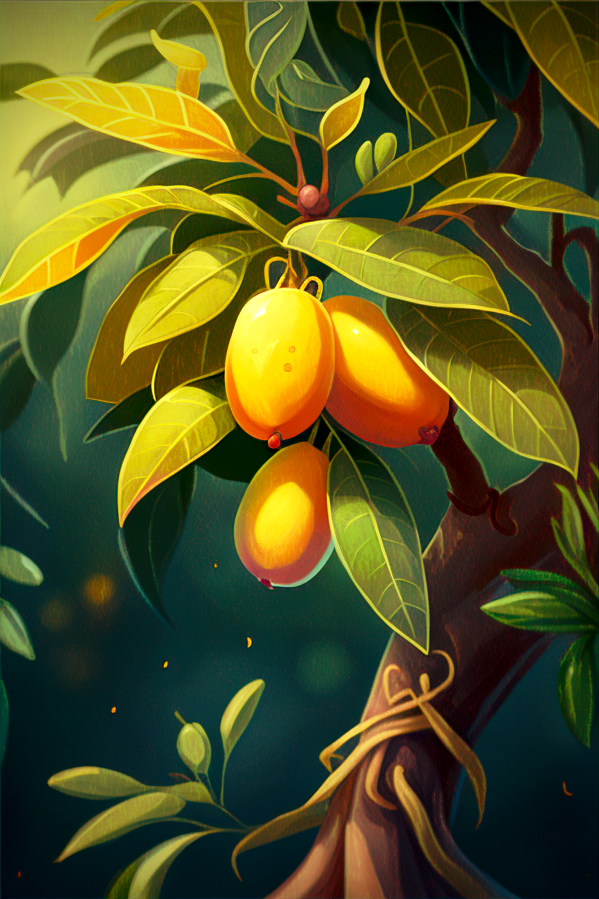 **Mango**         | `Yellow` | `Uncommon`:&nbsp;6 | `Mango Madness`: when Planted, pick and Opponent. Per every [Crop](#crops) they have growing, they must swap a [Card](#cards) from their [Hand](#hand) with a random [Card](#cards) from [Deck](#deck)                                  | 2            | 5          | 2          | 1.5 |
|       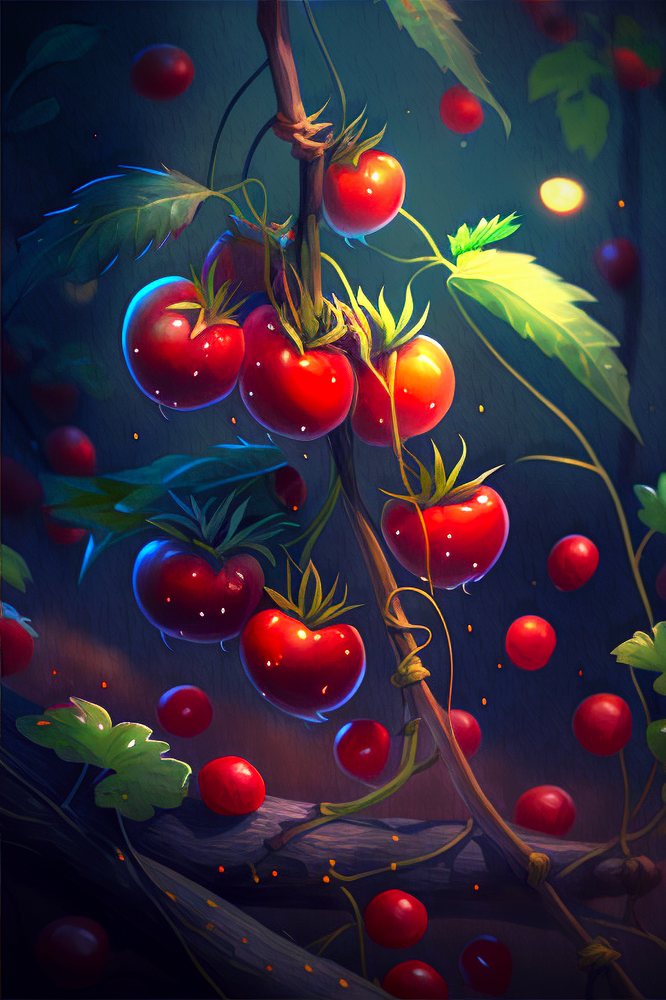 **Tomato**       | `Red`    | `Uncommon`:&nbsp;6 | `Catch up`: gains +1&nbsp;`Crop Value` for every Opponent with more [Coins](#coins) than you                                                                                                                                            | 2            | 5          | 2          | 1.5 |
|       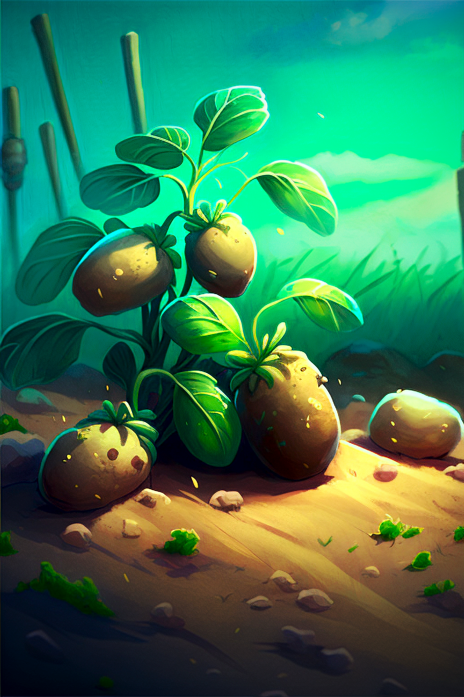 **Potato**       | `Green`  | `Uncommon`:&nbsp;6 | `Root Rot`: when Harvested, roll 1d4. If you roll 4, get a `Potato` [Card](#cards), otherwise gain 1 [Fertilizer](#fertilizers)                                                                                                         | 2            | 5          | 2          | 1.5 |
|        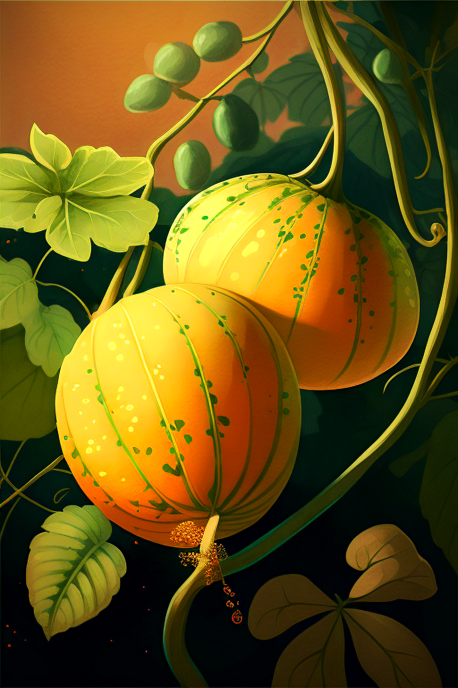 **Melon**         | `Yellow` | `Uncommon`:&nbsp;6 | `Melon Mania`: gain 1d4 extra [Coins](#coins) for the 2nd and the following `Melon` Harvested                                                                                                                                           | 2            | 6          | 2          | 2   |
|         **Beans**         | `Red`    | `Uncommon`:&nbsp;6 | `Beanstalk`: when Harvested, swap a [Card](#cards) from your [Hand](#hand) with a random one from [Deck](#deck)                                                                                                                         | 2            | 6          | 2          | 2   |
|        **Wasabi**       | `Green`  | `Uncommon`:&nbsp;6 | `Radish Rally`: when Planted, steal 1d4 [Coins](#coins) from a chosen Opponent, if you have another `Wasabi` in [Hand](#hand)                                                                                                           | 2            | 6          | 2          | 2   |
|  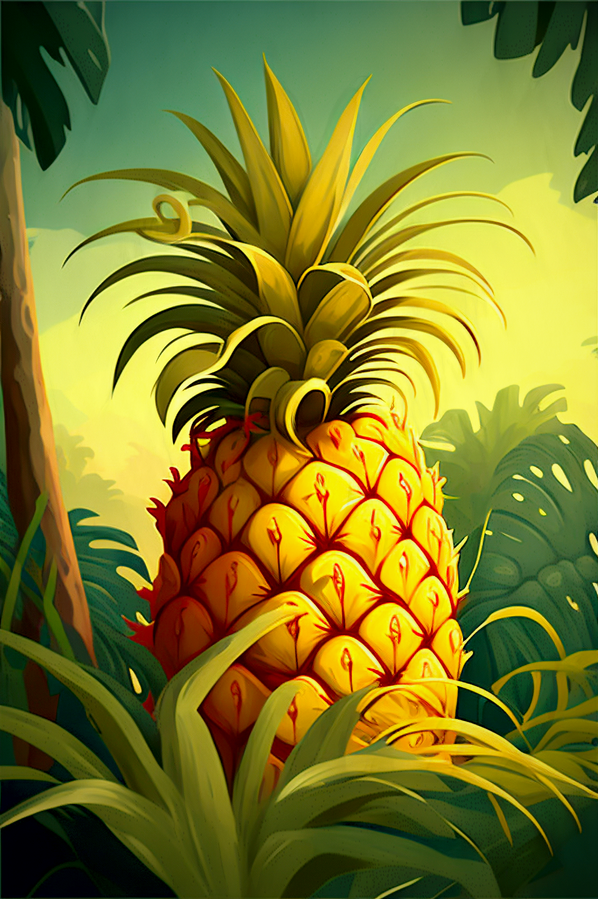 **Pineapple**   | `Yellow` |     `Rare`:&nbsp;4 | `Pineapple Punch`: when Harvested, destroy a [Crop](#crops) of your choice and return it's [Card](#cards) to [Deck](#deck)                                                                                                              | 3            | 9          | 3          | 2   |
|    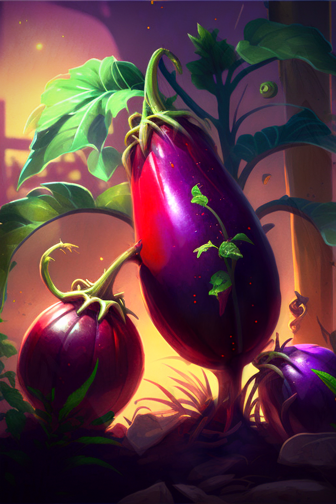 **Eggplant**    | `Red`    |     `Rare`:&nbsp;4 | `Eggplant Emoji`: when Planted, pick a Player. They lose 1 **Coin** per every [Card](#cards) in their [Hand](#hand)                                                                                                                     | 3            | 9          | 3          | 2   | 
|      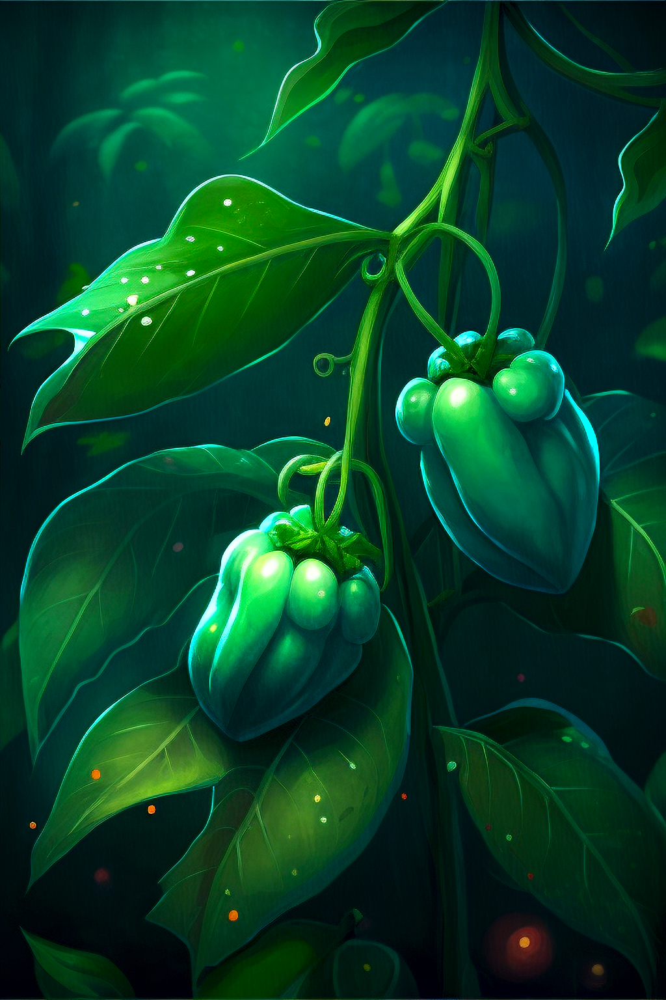 **Peppers**      | `Green`  |     `Rare`:&nbsp;4 | `Spicy Sprinkle`: when Harvested, roll 1d6. That many `Card Value` is distributed among your [Crop Cards](#crop-cards) in [Hand](#hand) (randomly)                                                                                      | 3            | 9          | 3          | 2   |
|  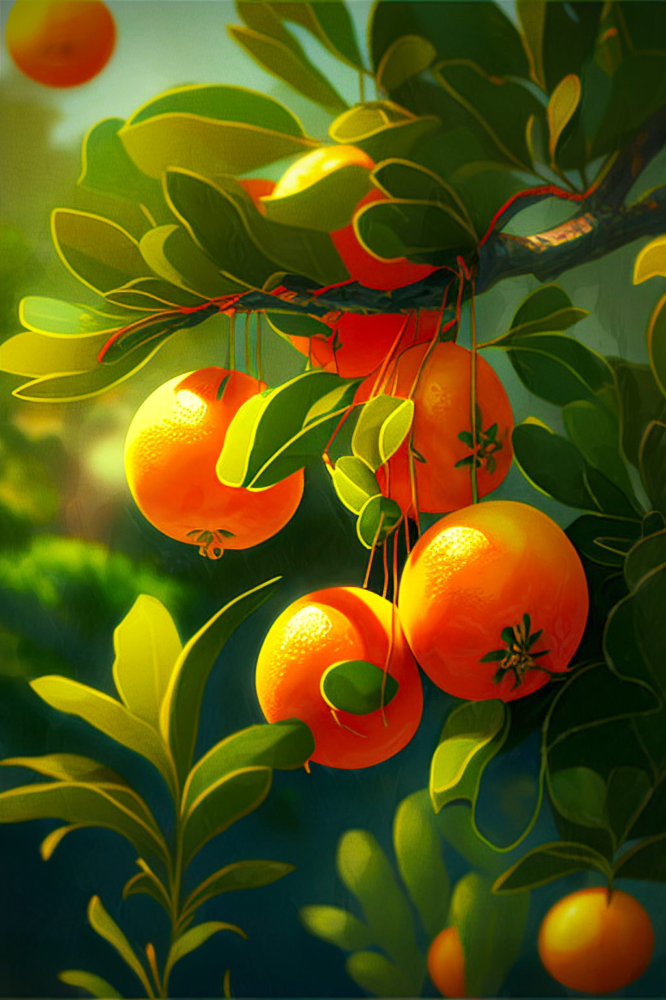 **Tangerine**   | `Yellow` |     `Epic`:&nbsp;2 | `Sweet and Sour`: when Planted and Harvested, all your other [Crops](#crops) gain 1 Value                                                                                                                                               | 5            | 15         | 4          | 2.5 |
|     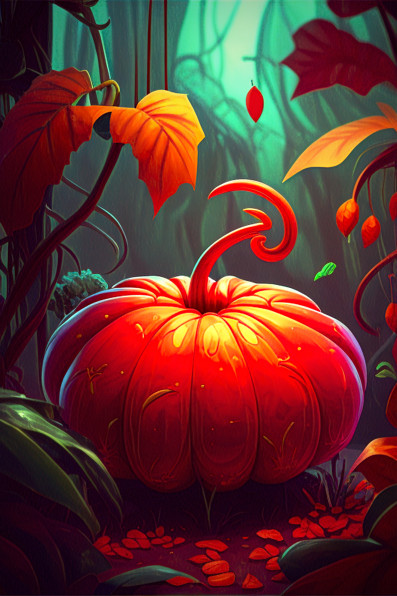 **Pumpkin**      | `Red`    |     `Epic`:&nbsp;2 | `Trick or Treat`: when Harvested, all Players give you 1 **Coin** for every [Fertilizer](#fertilizers) they have                                                                                                                        | 5            | 15         | 4          | 2.5 |
|         **Grape**        | `Green`  |     `Epic`:&nbsp;2 | `Grapevine`: when Harvested from `Common Bed` or `Raised Bed`, transform it into `Hydroponics`. Otherwise gain extra 4 [Coins](#coins)                                                                                                  | 5            | 15         | 4          | 2.5 |
| 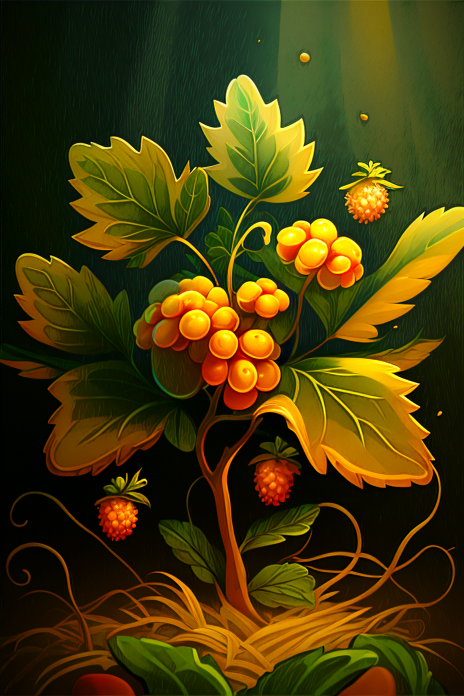 **Cloudberry** | `Yellow` |   `Mythic`:&nbsp;1 | `Berry Blitz`: when Planted, the [Card](#cards) with the biggest `Card Value` from each Opponents' [Hand](#hand) has its `Card Value` reduced to 1 and is returned to [Deck](#deck)                                                     | 8            | 21         | 5          | 2.6 |
| 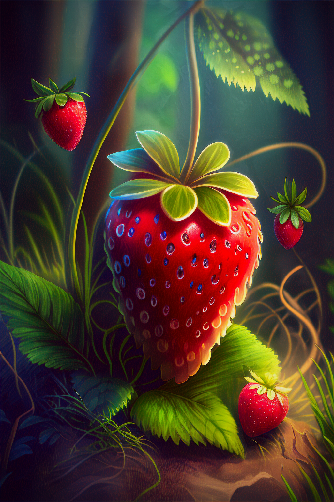 **Strawberry** | `Red`    |   `Mythic`:&nbsp;1 | `Ripe for the Picking`: when Harvested, pick any other [Crop](#crops) on the field. Gain its `Crop Value` in [Coins](#coins)                                                                                                            | 8            | 23         | 5          | 3   |
|   **Blueberry**   | `Green`  |   `Mythic`:&nbsp;1 | `Blueberry Boom`: when Planted, pick an Opponent's [Bed](#garden-beds). It's downgraded to a `Common Bed`, and its [Crop](#crops), if any, is destroyed. If the [Bed](#garden-beds) was a `Greenhouse`, the [Crop](#crops) is preserved | 8            | 22         | 5          | 2.8 |

### Action Cards

There is a set quantity of each [Action Card](#action-cards) in a [Deck](#deck), and they come in the same 5 [Rarities](#rarity) as [Crop Cards](#crop-cards). When played, the Player must discard both the [Action Card](#action-cards) and amount of [Fertilizers](#fertilizers), equal to `Card Value`. If the Player doesn't have enough [Fertilizers](#fertilizers), they can't play the [Card](#cards).

|                                               Name                                               | Card Value |           Quantity |     | Effect                                                                                                                                                                                                                                                                                                                                       |
|:------------------------------------------------------------------------------------------------:|------------|-------------------:|:----|----------------------------------------------------------------------------------------------------------------------------------------------------------------------------------------------------------------------------------------------------------------------------------------------------------------------------------------------|
|              **Garden Gourmet**             | 1          |   `Common`:&nbsp;6 |     | Choose a growing [Crop](#crops) and add the `Card Value` to that `Crop Value`                                                                                                                                                                                                                                                                |
|         **Fertilizer Frenzy**         | 1          |   `Common`:&nbsp;6 |     | Choose a growing [Crop](#crops). For each grade of that [Crop](#crops) Rarity, reduce it's `Crop Value` by 1 (1 for `Common`, 2 for `Uncommon`, etc.), down to 0                                                                                                                                                                             |
|                        **Recycle**                        | 0          |   `Common`:&nbsp;6 |     | Discard a [Card](#cards) from your [Hand](#hand), along with this one. For each grade of that [Card](#cards) Rarity, gain 1 [Fertilizers](#fertilizers) (1 for Common, 2 for Uncommon, etc.), and 1 more for this [Card](#cards)                                                                                                             |
|                    **Lucky Find**                   | 1          |   `Common`:&nbsp;6 |     | Gain 1d4 [Coins](#coins)                                                                                                                                                                                                                                                                                                                     |
|                     **Green Day**                     | 1          |   `Common`:&nbsp;6 |     | All `Green` [Crop Cards](#crop-cards) in your [Hand](#hand) increase their `Card Value` by 1                                                                                                                                                                                                                                                 |
|                       **Red Heat**                      | 1          |   `Common`:&nbsp;6 |     | All `Red` [Crop Cards](#crop-cards) in your [Hand](#hand) increase their `Card Value` by 1                                                                                                                                                                                                                                                   |
|                  **Yellow Gold**                  | 1          |   `Common`:&nbsp;6 |     | All `Yellow` [Crop Cards](#crop-cards) in your [Hand](#hand) increase their `Card Value` by 1                                                                                                                                                                                                                                                |
|                 **Weed Whacker**                 | 2          | `Uncommon`:&nbsp;4 |     | Gain 1 **Coin** per every [Card](#cards) in [Hand](#hand)                                                                                                                                                                                                                                                                                    | 
|                 **Pest Control**                | 1          | `Uncommon`:&nbsp;4 |     | All your growing [Crops](#crops) increase their `Crop Value` by 1                                                                                                                                                                                                                                                                            |
|  **Supernatural Selection** | 3          | `Uncommon`:&nbsp;4 |     | Pick any other [Card](#cards) in your [Hand](#hand) and increase its `Card Value` by 4                                                                                                                                                                                                                                                       |
|                 **Flower Power**                | 3          | `Uncommon`:&nbsp;4 |     | Gain 1 [Fertilizer](#fertilizers) for each unique growing [Crop](#crops) on the game field                                                                                                                                                                                                                                                   |
|                  **Fungus Flay**                  | 3          | `Uncommon`:&nbsp;4 |     | All currently growing [Crops](#crops) of a chosen `Color` in the game field lose 1&nbsp;`Crop Value`, down to 0. Does not affect [Crops](#crops) in **Greenhouses**.                                                                                                                                                                         |
|         **Surging Seedlings**         | 3          | `Uncommon`:&nbsp;4 |     | For each empty **Garden Bed** you have, draw 1 [Card](#cards) from the [Deck](#deck)                                                                                                                                                                                                                                                         |
|                 **Thorny Fence**                | 3          |     `Rare`:&nbsp;3 |     | All [Cards](#cards) in a chosen Player's [Hand](#hand) lose 1&nbsp;`Card Value`                                                                                                                                                                                                                                                              |
|            **Soil Enrichment**            | 2          |     `Rare`:&nbsp;3 |     | All currently growing [Crops](#crops) in your beds have their _Ripe Timer_ reduced by 1                                                                                                                                                                                                                                                      |
|                  **Seed Sprout**                  | 3          |     `Rare`:&nbsp;3 |     | Draw 1 [Card](#cards) from the [Deck](#deck) for each unique `Color` of growing [Crops](#crops) in your garden, up to 3                                                                                                                                                                                                                      |
|            **Pollen Paradise**            | 2          |     `Rare`:&nbsp;3 |     | Take two [Cards](#cards) from the [Deck](#deck). Pick 1 [Card](#cards) to be added to your [Hand](#hand), return another one to the [Deck](#deck). Gain 1 [Fertilizer](#fertilizers) for each [Card](#cards) in your [Hand](#hand), that is of the same `Color` as the one you've just picked                                                |
|  **Retractable Greenhouse** | 1          |     `Rare`:&nbsp;3 |     | Transform any [Bed](#garden-beds) into `Greenhouse`, keeping the [Crop](#crops) safe.                                                                                                                                                                                                                                                        | 
|                 **Garden Gnome**                | 1          |     `Rare`:&nbsp;3 |     | Every Opponent discards 1 random [Card](#cards) from their [Hand](#hand) for every `Card Value` of this [Card](#cards)                                                                                                                                                                                                                       |
|                  **Trellis Bed**                  | 2          |     `Epic`:&nbsp;2 |     | Transform any [Bed](#garden-beds) into `Trellis`                                                                                                                                                                                                                                                                                             |
|                 **Vertical Bed**                | 2          |     `Epic`:&nbsp;2 |     | Transform any [Bed](#garden-beds) into `Vertical Bed`                                                                                                                                                                                                                                                                                        |
|              **Rotational Bed**             | 2          |     `Epic`:&nbsp;2 |     | Transform any [Bed](#garden-beds) into `Rotational Bed`                                                                                                                                                                                                                                                                                      |
|              **Waste Disposal**             | 3          |     `Epic`:&nbsp;2 |     | Choose any **Player**. For every card in their [Hand](#hand), their growing [Crops](#crops) lose 1&nbsp;`Crop Value`                                                                                                                                                                                                                         |
|           **Cartel Agreement**          | 4          |     `Epic`:&nbsp;2 |     | Take 1 random [Card](#cards) from the [Market](#market) and add it to your [Hand](#hand). Then, return the remaining [Cards](#cards) from the [Market](#market) to the [Deck](#deck) randomly and refill the [Market](#market)                                                                                                               |
|              **Chemical Bliss**             | 1          | `Mythical`:&nbsp;1 |     | Roll d6 for each unit of this `Card Value`. Gain as many [Fertilizers](#fertilizers)                                                                                                                                                                                                                                                         |
|                        **Drought**                        | 4          | `Mythical`:&nbsp;1 |     | All currently growing [Crops](#crops) have their _Ripe Timer_ increased by 2                                                                                                                                                                                                                                                                 |
|                           **Clone**                           | 4          | `Mythical`:&nbsp;1 |     | Choose any growing [Crop](#crops). Add an identical [Crop Card](#crop-cards) to your [Hand](#hand)                                                                                                                                                                                                                                           |
|                          **Wither**                         | 3          | `Mythical`:&nbsp;1 |     | Choose any growing [Crop](#crops). It is destroyed, and the [Crop Card](#crop-cards) is discarded                                                                                                                                                                                                                                            |
|                **Demon of Harvest**                | 0          | `Mythical`:&nbsp;1 |     | Roll 1d20.  On 20, immediately collect _all_ growing [Crops](#crops) in the Game.  Otherwise, discard that many [Fertilizer](#fertilizers) and take any combination of [Cards](#cards) from the [Market](#market) for the same price or less.  If you don't have enough [Fertilizers](#fertilizers), all your growing Crops die. |

## Classes
Every Player is playing a certain [Class](#classes), which defines his set of [Beds](#garden-beds), starting [Cards](#cards), [Coins](#coins) and provides them with a unique [Action Card](#action-cards)

|                                   Class                                    | Starting Bonus                                  | Starting Beds                                                                      | Action Card                                                                                                                                                                                                                            | Action Card Cost              |
|:--------------------------------------------------------------------------:|-------------------------------------------------|------------------------------------------------------------------------------------|----------------------------------------------------------------------------------------------------------------------------------------------------------------------------------------------------------------------------------------|-------------------------------|
|         **Land Baron**         | +2 [Coins](#coins)                              | 1&nbsp;`Common`  2&nbsp;`Greenhouse`                                           |  `Land Reclamation`: once per game, pick a [Card](#cards) you previously discarded and add two copies of it to your [Hand](#hand)                                              | 4 [Fertilizers](#fertilizers) |
|        **Grim Reaper**        | +2 [Fertilizers](#fertilizers)                  | 1&nbsp;`Common`  2&nbsp;`Raised`                                               |  `Rip And Sow`:  once per game, choose a [Crop](#crops) `Color`. All Opponents give you all their [Crop Cards](#crop-cards) of that `Color`, if they have any                           | 3 [Fertilizers](#fertilizers) |
|  **Master Gardener** | Extra [Beds](#garden-beds)                      | 1&nbsp;`Common` 1&nbsp;`Trellis` 1&nbsp;`Vertical` 1&nbsp;`Rotational` | 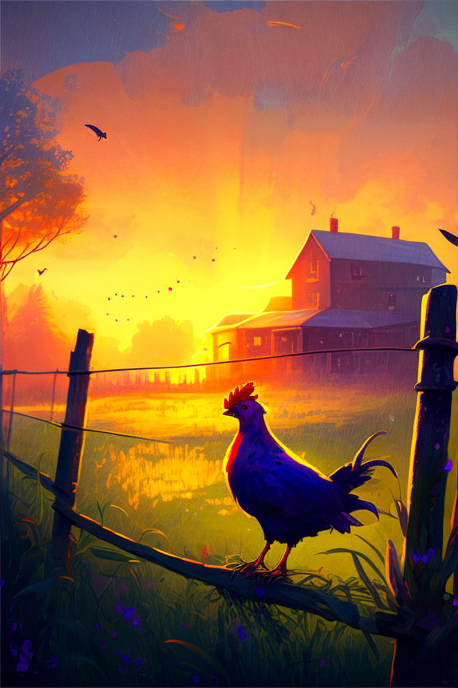 `Early Bird`: once per game, Harvest all your growing [Crops](#crops) immediately. Draw a [Card](#cards) from the [Deck](#deck)                                                           | 3 [Fertilizers](#fertilizers) |
|   **Crop Scientist**   | +1 Random `Common` [Action Card](#action-cards) | 1&nbsp;`Common` 2&nbsp;`Hydroponic`                                            |  `Genetic Modification`: once per game, all your growing [Crops](#crops) have their `Crop Value` doubled                                                               | 2 [Fertilizer](#fertilizers)  |
|        **Seed Trader**       | +1 Random `Common` [Crop Card](#crop-cards)     | 1&nbsp;`Common`  1&nbsp;`Greenhouse`  1&nbsp;`Raised`                      | 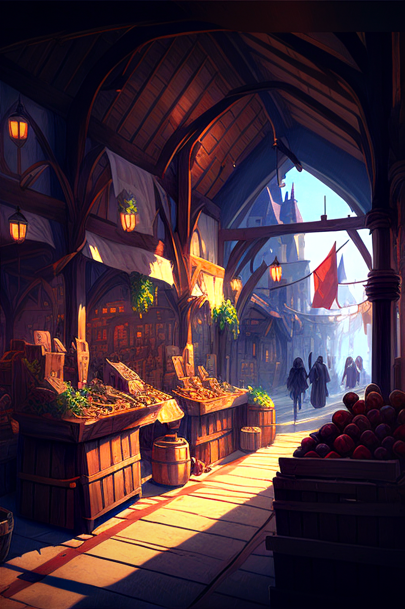 `Black Friday`: All Players ' _[Hand](#hand)s_ are returned to the [Deck](#deck). [Market](#market) [Cards](#cards) are discarded. For every [Card](#cards) affected, gain **1 Coin** | 4 [Fertilizers](#fertilizers) |
|  **Weather Watcher** | +1 [Fertilizer](#fertilizers), +1 **Coin**      | 1&nbsp;`Common`  1&nbsp;`Greenhouse`  1&nbsp;`Hydroponic`                  |  `Cloud Cover`: once per game, chosen Opponent's [Crops](#crops) randomly add 1d4 to their `Reap Timer`.                                                                                 | 2 [Fertilizers](#fertilizers) |

