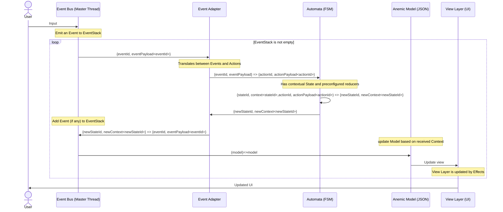

# Architectural Concept/HLD
## Core architecture

```mermaid
sequenceDiagram
actor User
participant MT as Event Bus (Master Thread)
participant EA as Event Adapter
participant FSM as Automata (FSM)
participant MDL as Anemic Model (JSON)
participant VL as View Layer (UI)
User->>MT: Input
Note over MT: Emit an Event to EventStack
loop EventStack is not empty
MT->>EA: {eventId, eventPayload<eventId>}
Note over EA: Translates between Events and Actions 
EA->>FSM: {eventId, eventPayload} => {actionId, actionPayload<actionId>}
Note over FSM: Has contextual State and preconfigured reducers
FSM->>FSM: {stateId, context<stateId>,actionId, actionPayload<actionId>) => {newStateId, newContext<newStateId>}
FSM->>EA: {newStateId, newContext<newStateId>}
Note over MT: Add Event (if any) to EventStack
EA->>MT: {newStateId, newContext<newStateId>} => {eventId, eventPayload<eventId>}
Note over MDL: update Model based on received Context
MT->>MDL: (model)=>model
MDL->>VL: Update view
Note over VL: View Layer is updated by Effects
end
VL->>User: Updated UI
```
