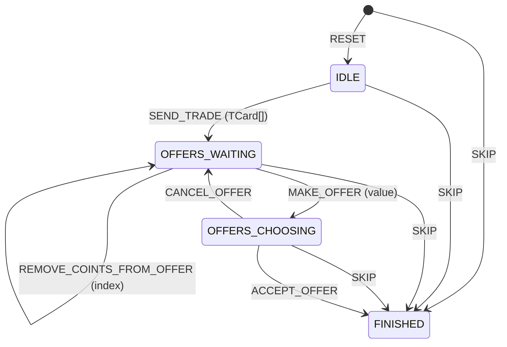
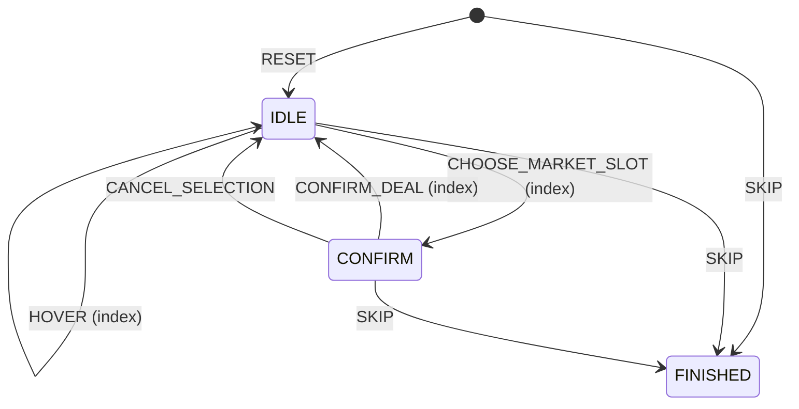
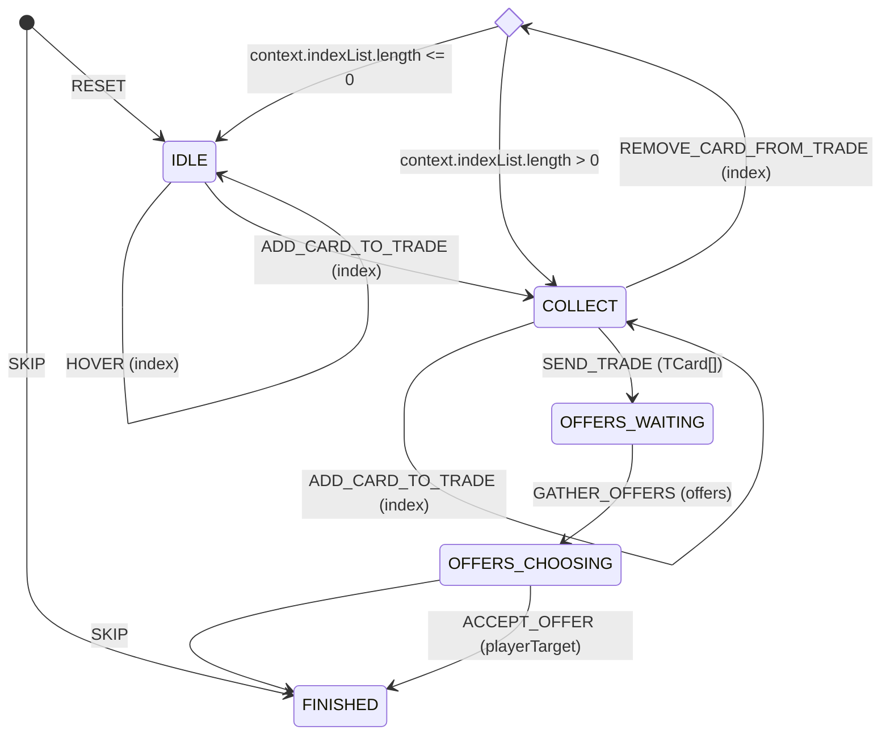
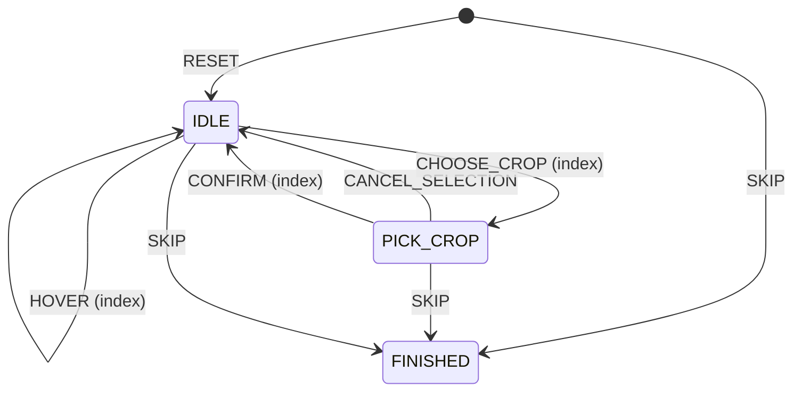

State Diagrams for Finite State Machines
================================

## Turn Phases

### Waiting (accepting Trade)

```mermaid
stateDiagram-v2
[*] --> IDLE: RESET
[*] --> FINISHED: SKIP 
IDLE --> OFFERS_WAITING: SEND_TRADE (TCard[])
IDLE --> FINISHED: SKIP
OFFERS_WAITING --> OFFERS_WAITING: ADD_COINS_TO_OFFER (index)
OFFERS_WAITING --> OFFERS_WAITING: REMOVE_COINTS_FROM_OFFER (index)
OFFERS_WAITING --> OFFERS_CHOOSING: MAKE_OFFER (value)
OFFERS_CHOOSING --> OFFERS_WAITING: CANCEL_OFFER
OFFERS_WAITING --> FINISHED: SKIP
OFFERS_CHOOSING --> FINISHED: SKIP
OFFERS_CHOOSING --> FINISHED: ACCEPT_OFFER
```

### Shopping

```mermaid
stateDiagram-v2
[*] --> IDLE: RESET
[*] --> FINISHED: SKIP
IDLE --> IDLE: HOVER (index)
IDLE --> CONFIRM: CHOOSE_MARKET_SLOT (index)
CONFIRM --> IDLE: CONFIRM_DEAL (index)
CONFIRM --> IDLE: CANCEL_SELECTION
IDLE --> FINISHED: SKIP
CONFIRM --> FINISHED: SKIP
```

### Trading

```mermaid
stateDiagram-v2
state remove_last <<choice>>
COLLECT --> COLLECT: HOVER (index)
COLLECT --> COLLECT: ADD_CARD_TO_TRADE (index)
[*] --> FINISHED: SKIP
remove_last --> IDLE: context.indexList.length <= 0
remove_last --> COLLECT: context.indexList.length > 0
OFFERS_CHOOSING --> FINISHED: SKIP
OFFERS_CHOOSING --> FINISHED: ACCEPT_OFFER (playerTarget)
IDLE --> IDLE: HOVER (index)
IDLE --> COLLECT: ADD_CARD_TO_TRADE (index)
OFFERS_WAITING --> OFFERS_CHOOSING: GATHER_OFFERS (offers)
COLLECT --> remove_last: REMOVE_CARD_FROM_TRADE (index)
COLLECT --> OFFERS_WAITING: SEND_TRADE (TCard[])
[*] --> IDLE: RESET
```

### Fertilizing

```mermaid
stateDiagram-v2
[*] --> IDLE: RESET
[*] --> FINISHED: SKIP
PICK_CROP --> IDLE: CANCEL_SELECTION
PICK_CROP --> IDLE: CONFIRM (index)
IDLE --> IDLE: HOVER (index)
PICK_CROP --> FINISHED: SKIP
IDLE --> FINISHED: SKIP
IDLE --> PICK_CROP: CHOOSE_CROP (index)
```