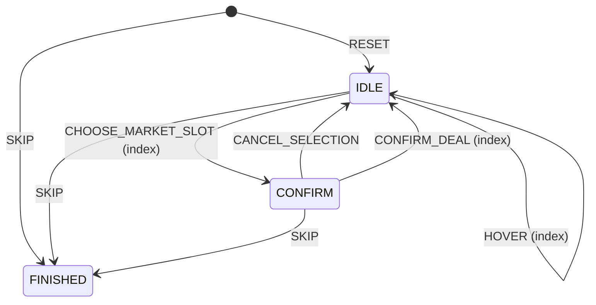
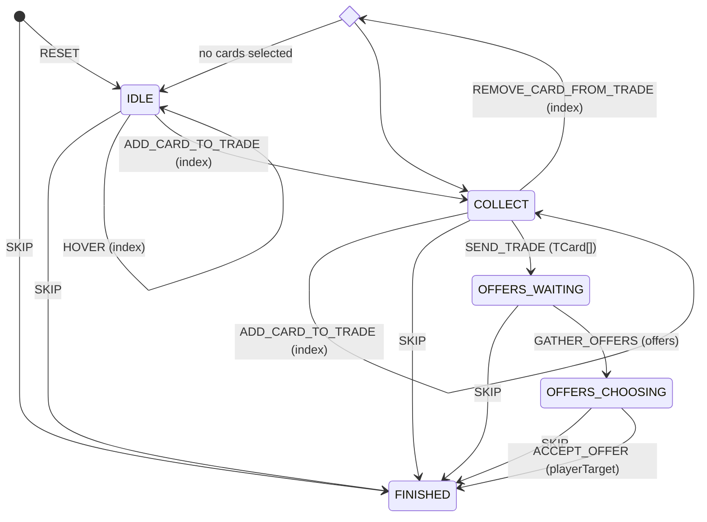
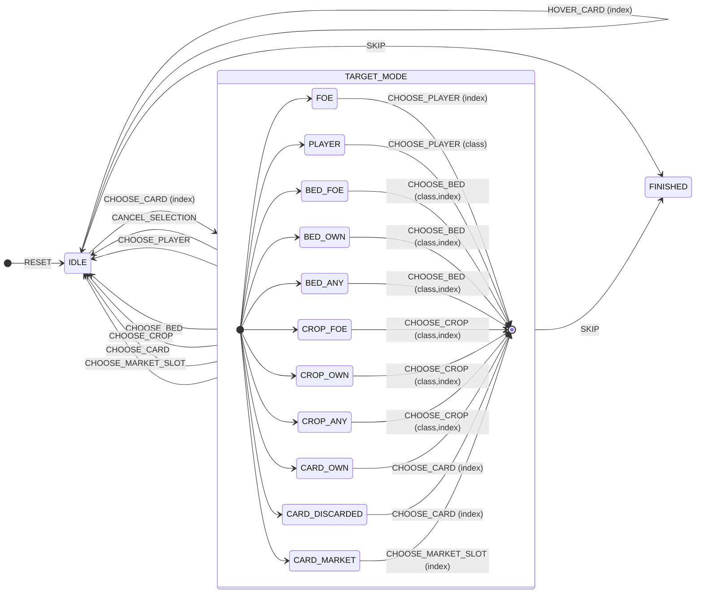
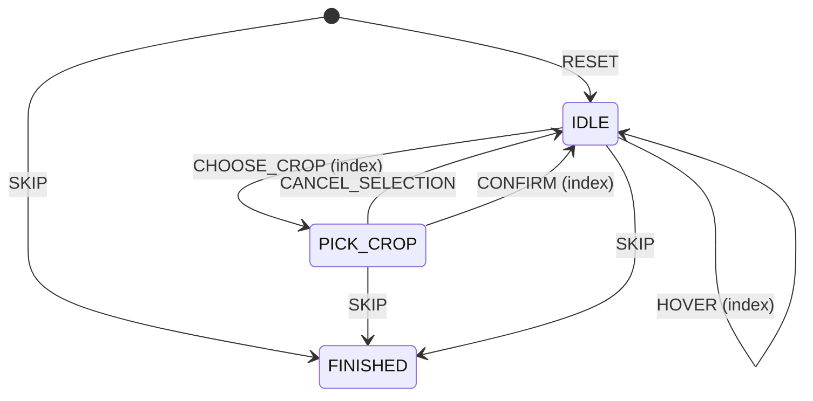
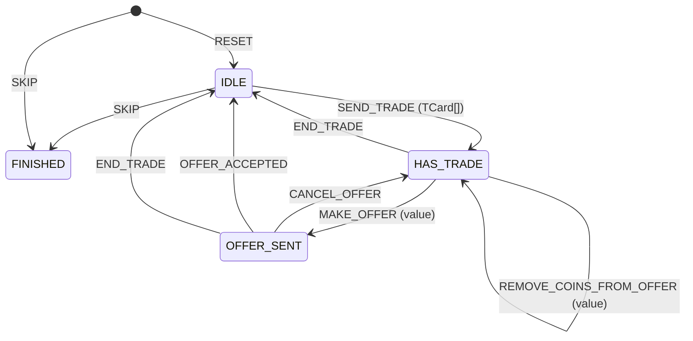

State Diagrams for Finite State Machines
================================

## Turn Phases

### Shopping

```mermaid
stateDiagram-v2
[*] --> FINISHED: SKIP
IDLE --> FINISHED: SKIP
CONFIRM --> FINISHED: SKIP
CONFIRM --> IDLE: CANCEL_SELECTION
CONFIRM --> IDLE: CONFIRM_DEAL (index)
IDLE --> IDLE: HOVER (index)
IDLE --> CONFIRM: CHOOSE_MARKET_SLOT (index)
[*] --> IDLE: RESET
```

### Trading

```mermaid
stateDiagram-v2
state remove_last <<choice>>
COLLECT --> COLLECT: HOVER (index)
COLLECT --> COLLECT: ADD_CARD_TO_TRADE (index)
[*] --> FINISHED: SKIP
[*] --> IDLE: RESET
COLLECT --> FINISHED: SKIP
OFFERS_WAITING --> FINISHED: SKIP
OFFERS_CHOOSING --> FINISHED: SKIP
IDLE --> FINISHED: SKIP
remove_last --> IDLE: no cards selected
remove_last --> COLLECT
OFFERS_CHOOSING --> FINISHED: ACCEPT_OFFER (playerTarget)
IDLE --> IDLE: HOVER (index)
IDLE --> COLLECT: ADD_CARD_TO_TRADE (index)
OFFERS_WAITING --> OFFERS_CHOOSING: GATHER_OFFERS (offers)
COLLECT --> remove_last: REMOVE_CARD_FROM_TRADE (index)
COLLECT --> OFFERS_WAITING: SEND_TRADE (TCard[])
```

### Playing Cards

```mermaid
stateDiagram-v2
direction LR
[*] --> IDLE: RESET
IDLE --> IDLE: HOVER_CARD (index)
IDLE --> TARGET_MODE: CHOOSE_CARD (index)
IDLE --> FINISHED: SKIP
TARGET_MODE --> FINISHED: SKIP
TARGET_MODE --> IDLE: CANCEL_SELECTION
TARGET_MODE --> IDLE: CHOOSE_PLAYER
TARGET_MODE --> IDLE: CHOOSE_BED
TARGET_MODE --> IDLE: CHOOSE_CROP
TARGET_MODE --> IDLE: CHOOSE_CARD
TARGET_MODE --> IDLE: CHOOSE_MARKET_SLOT
state TARGET_MODE {
    direction LR
    [*]-->FOE
    [*]-->PLAYER
    [*]-->BED_FOE
    [*]-->BED_OWN
    [*]-->BED_ANY
    [*]-->CROP_FOE
    [*]-->CROP_OWN
    [*]-->CROP_ANY
    [*]-->CARD_OWN
    [*]-->CARD_MARKET
    [*]-->CARD_DISCARDED
    FOE --> [*]: CHOOSE_PLAYER (index)
    PLAYER --> [*]: CHOOSE_PLAYER (class)
    BED_FOE --> [*]: CHOOSE_BED (class,index)
    BED_OWN --> [*]: CHOOSE_BED (class,index)
    BED_ANY --> [*]: CHOOSE_BED (class,index)
    CROP_FOE --> [*]: CHOOSE_CROP (class,index)
    CROP_OWN --> [*]: CHOOSE_CROP (class,index)
    CROP_ANY --> [*]: CHOOSE_CROP (class,index)
    CARD_OWN --> [*]: CHOOSE_CARD (index)
    CARD_DISCARDED --> [*]: CHOOSE_CARD (index)
    CARD_MARKET --> [*]: CHOOSE_MARKET_SLOT (index)
    }
```

### Fertilizing

```mermaid
stateDiagram-v2
[*] --> FINISHED: SKIP
[*] --> IDLE: RESET
PICK_CROP --> FINISHED: SKIP
IDLE --> FINISHED: SKIP
IDLE --> IDLE: HOVER (index)
IDLE --> PICK_CROP: CHOOSE_CROP (index)
PICK_CROP --> IDLE: CANCEL_SELECTION
PICK_CROP --> IDLE: CONFIRM (index)
```

### Waiting (accepting Trade)

```mermaid
stateDiagram-v2
[*] --> IDLE: RESET
IDLE --> FINISHED: SKIP
[*] --> FINISHED: SKIP 
IDLE --> HAS_TRADE: SEND_TRADE (TCard[])
HAS_TRADE --> OFFER_SENT: MAKE_OFFER (value)
OFFER_SENT --> HAS_TRADE: CANCEL_OFFER
OFFER_SENT --> IDLE: OFFER_ACCEPTED
OFFER_SENT --> IDLE: END_TRADE
HAS_TRADE --> HAS_TRADE: ADD_COINS_TO_OFFER (value)
HAS_TRADE --> HAS_TRADE: REMOVE_COINS_FROM_OFFER (value)
HAS_TRADE --> IDLE: END_TRADE
```
