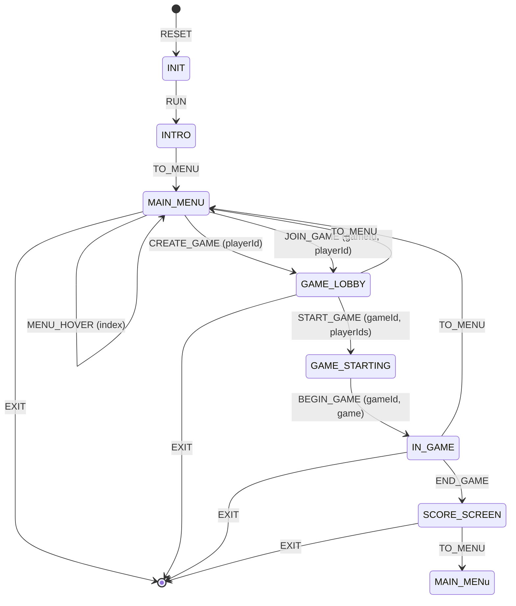
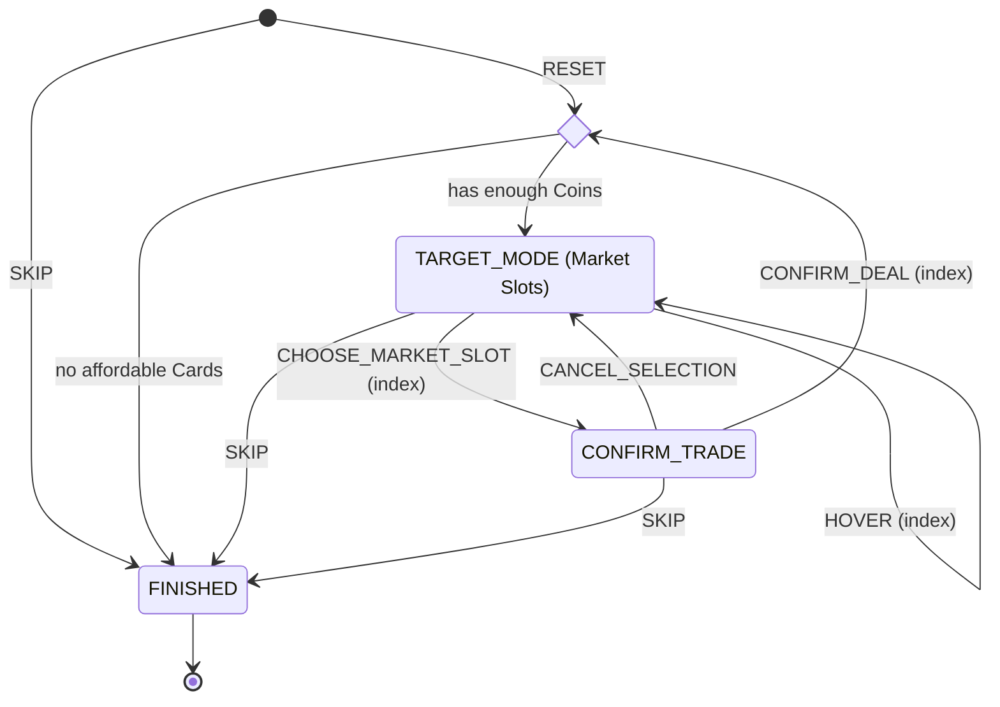
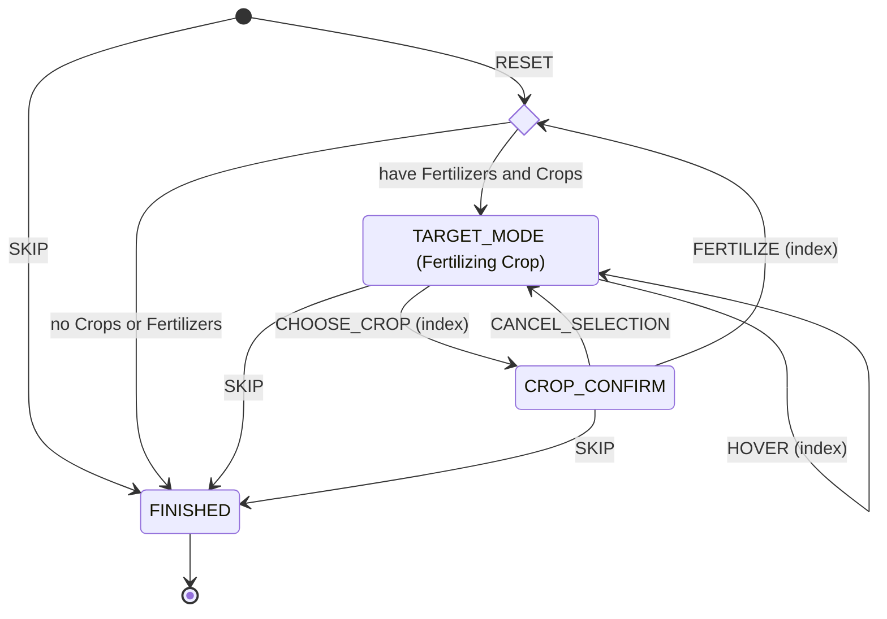

State Diagrams for Finite State Machines
================================

<!-- TOC -->
  * [Window Mode](#window-mode)
  * [Target Mode](#target-mode)
  * [Game Loop](#game-loop)
  * [Turn Loop](#turn-loop)
  * [Turn Phases](#turn-phases)
    * [Harvest](#harvest)
    * [Shopping](#shopping)
    * [Trading](#trading)
    * [Playing Cards](#playing-cards)
    * [Fertilizing](#fertilizing)
    * [Waiting](#waiting)
<!-- TOC -->

## Window Mode

Every Window Mode represent different visual layout and different reactions to user input, including keystrokes

## Target Mode

Target Mode is a parallel automata that blocks parent state transition until resolved. Target Mode can be turned on for a Player in almost any phase of Turn either by playing a Card or being a target of other Player's Card. In the latter case, `SKIP` forces a random choice of target, while in the former it returns the Card to Hand.

## Game Loop

Game Loop is a state machine that represents the lifecycle of a single game, starting with players agreeing to start a game

## Turn Loop
Turn Loop is triggered with `TURN_START` from Game Loop and is resolved by triggering `TURN_END`. Every transition within Turn Loop is triggered with `TURN_PHASE_START`, and the `FINISHED` state of the corresponding Turn Phase triggers `TURN_PHASE_END`

## Turn Phases

### Harvest

Harvest Phase is autonomous unless Harvesting a Crop that has a corresponding effect, requiring a current Player to choose some target. In that case, after harvesting that Crop the Player is forced into a corresponding Target Mode for 15s. If they fail to choose a Target, the effect appliance is skipped. 

### Shopping

One of the simplest Phases, Shopping enables Target Mode (`CARD_MARKET` mode) by default. The current Player can't choose Cards that they can't afford. Otherwise, there is a confirmation step and an option to `SKIP` the Phase at any stage. This Phase cannot be interrupted by indirect Target Mode.

### Trading

Trading is a three-step transaction:
- the current Player proposes a subset of Cards from their Hand for Trade;
- all `Waiting` Players receive a Trade proposal and can adjust an offer before sending it back to the current Player (see [Waiting](#waiting)). While they do so, the current Player resides in `OFFERS_WAITING` state;
- the current Player accepts one of the offers or `SKIP`s
The current Player can also `SKIP` at any stage, canceling all possible changes to the game state. 

### Playing Cards

Playing Cards is arguably the longest and the most complex Turn Phase, which flowchart significantly depends on type of Card played. The state graph is essentially a loop, which is automatically skipped when the Player runs out of Cards or by 30s timer

### Fertilizing

Fertilizing Phase is pretty straightforward and allows the current Player to expend Fertilizer on their growing Plant (including enemies'), requiring confirmation to apply. By default, the current Player is always in Target Mode (`CROP_OWN` mode). This Phase can't be interrupted by indirect Target Mode.

### Waiting

Waiting Phase is the last Phase of the Turn, and Players transition to that Phase one by one. When the Player has finished their Turn and reside in this state, they might be bothered to place Trade Offers or to enter Target Mode to apply Effects from other Players, notably from them Planting, Fertilizing or Harvesting Crops and from playing Action Cards. Thus, Trade options and Target mode never intersect.

